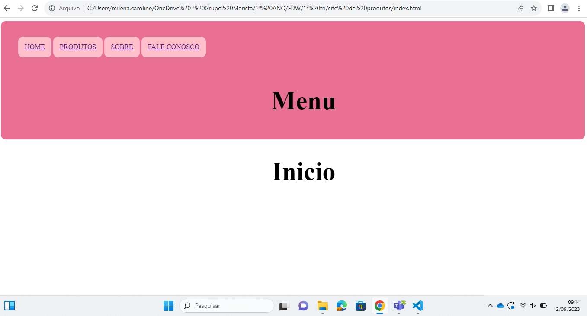
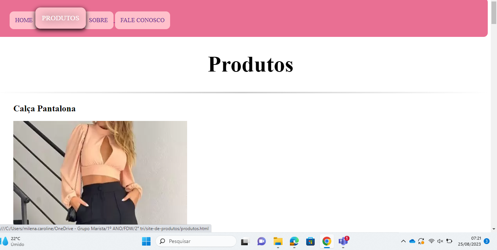

# 🚀 <h1 aling="center">Projeto - Site de venda de produtos</h1>
Site de Produtos criado durante as aulas de Fundamentos de desenvolvimento web. Nessas aulas, o professor trabalhou css, html.

## 📋 Sobre o Site de produtos

O projeto de site de produtos foi composto pela seguinte matéria:

* Fundamentos de Desenvolvimento Web

## 📄 Descrição do projeto

Atividade desenvolvida na aula de Fundamentos e Desenvolvimento Web. <br>
O site de produtos tem como objetivo, aprender como desenvolver um site de sua preferência. Utilizamos linguagem de programação, css e Html.<br>
O produto escolhido foi roupas, achei que seria um tema interessamte de ser feito, pegando  algumas ideias em outros sites que obtiam o mesmo intuito, com ajuda do professor Léo, consegui criar o site. <br>
Utilizei o img para adicionar as imagens de minha preferência. Utilizei também o  background-color para deixar o site mais bonito ao ver. Ultilizei mais do que apenas esses comandos, porque um site exige de você muito tempo, cuidado e atenção, usando varios comandos necessarios para ficar perfeito. <br>
Como usar? <br>
Logo entrando no site, você ja ira ver a tela inicial, menu. <br>
<br>
 
>
Do lado esquerdo da tela, está os botões para te levar aos produtos, ou se você tiver alguma duvida, ele esta lhe ajudando a ultilizar o site corretamente. <br>
Entrando em "Produtos" você podera visualizar os produtos do site, e escolher a roupa de sua preferência.
 
 >
<br>
Na descrição dos produtos, tem diversas foras de pagamento, numeração do produto,cor,material,quantidade,marca, etc.<br>
<br>

## 🔧 Tecnologias e ferramentas

* VSCODE

* HTML5 - utilizando elmentos:

```
img 
```
```
head
```

* CSS3

* Github - foi necessário utilizar os seguintes comandos:
```
git clone
```
```
git add .
```
```
git commit -m "mensagem de alteração realizada"
```
```
git push
```
```
git status
```
## Referências de consulta
```
[Alura](https://www.alura.com.br/artigos/escrever-bom-readme) - Como escrever um README incrível no seu Github
[lohhans](https://gist.github.com/lohhans/f8da0b147550df3f96914d3797e9fb89) - Um modelo para fazer um bom README
```
